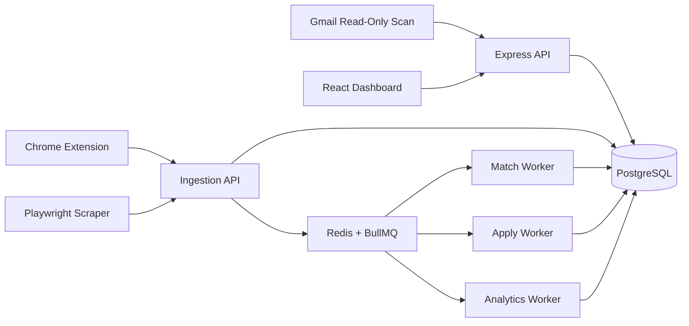
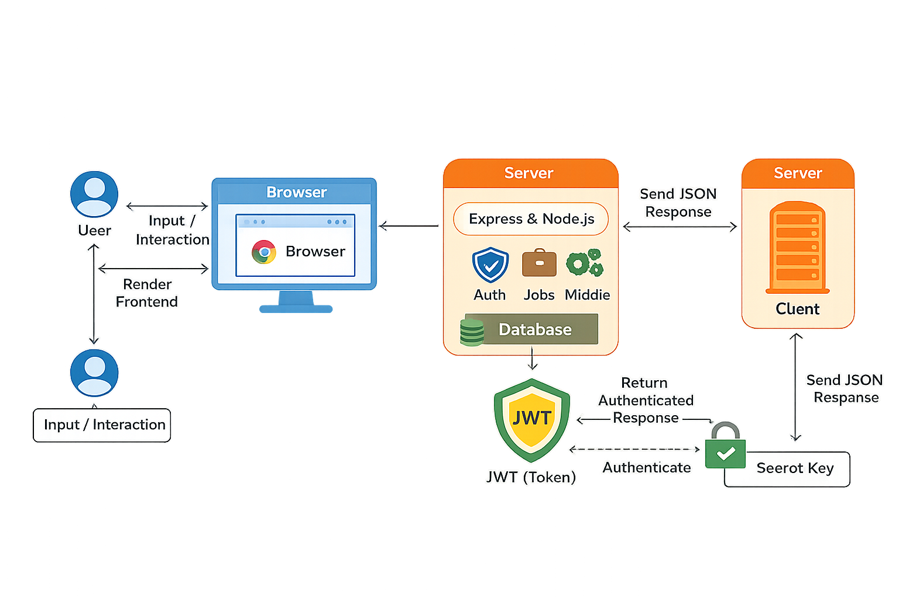
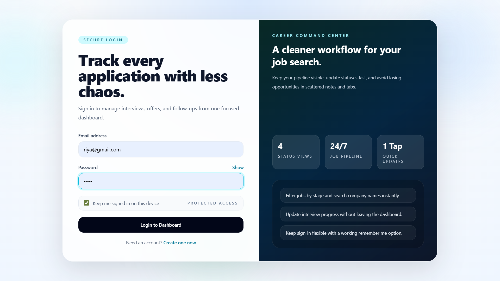
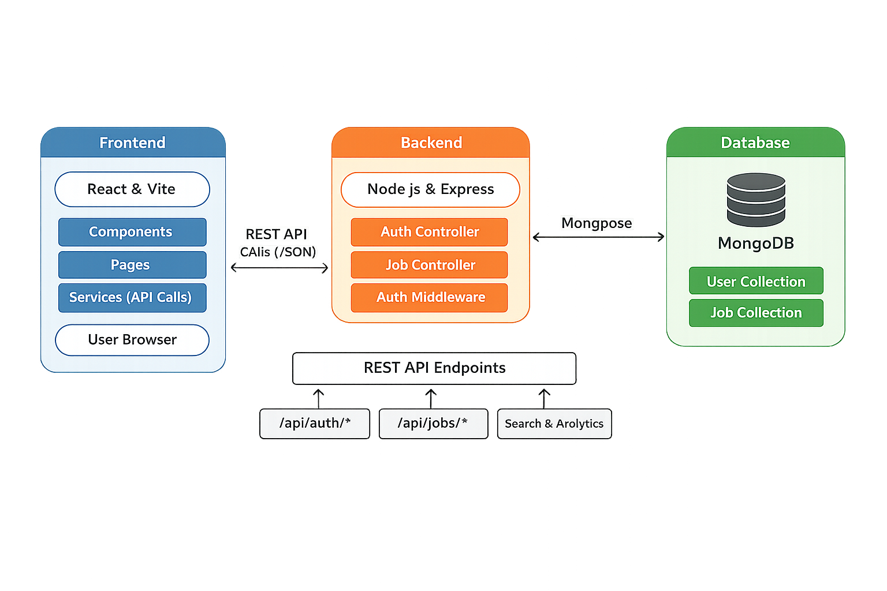

# Automated Job Application Tracking System with Email Ingestion and Analytics Pipeline

## TL;DR (For Recruiters)

A backend-heavy system that treats job search as a data pipeline, not a CRUD app.

- Ingestion → deduplication → scoring → application → analytics pipeline
- Async architecture using BullMQ (API latency independent of scraping/automation)
- Duplicate suppression (~65%) using hash + bounded fuzzy matching
- Explainable job ranking (TF-IDF + adaptive skill weights)
- Human-in-the-loop Playwright automation (no blind submissions)
- Feedback loop that adjusts ranking based on outcomes

Tech: Node.js, PostgreSQL, Redis, BullMQ, Playwright

Designed as a production-style system with queues, workers, and failure handling — not a UI-first project.

---

## Why This Project Stands Out

Most job trackers stop at CRUD: storing applications.

This system focuses on the harder problems:

- Identity resolution across noisy external sources
- Ranking before action (deciding what to apply to)
- Automating preparation without automating risk
- Learning from outcomes instead of static filtering

The result is a system that reduces decision fatigue, not just tracks history.

---

A backend system for ingesting job listings, deduplicating them, scoring relevance against a candidate profile, preparing applications with a human in the loop, and learning from outcomes.

The frontend and browser extension are control surfaces. The system's value is in the pipeline behind them, not in the UI.

The system exposes a minimal CRUD surface (`/api/jobs`, `/api/auth`) used as a control layer. The core value is the ingestion → decision → execution pipeline implemented behind it.

---

## Problem Statement

The failure mode in job search is not a shortage of listings. It is the operational cost of processing them once volume goes up.

At 10–30 applications a week across LinkedIn, Indeed, and direct company pages, three things break down:

- The same role gets cross-posted across sources. A spreadsheet has no concept of identity, so "Backend Engineer @ Acme" seen twice is recorded as two jobs, not one.
- Relevance gets judged by re-reading every description by hand. Nothing ranks listings against an actual resume before the candidate spends 15 minutes filling out a form.
- Outcomes never feed back into future decisions. There is no way to know that `django` listings you keep matching on aren't converting, while ones mentioning `postgresql` are.

This is a backend problem — identity resolution, ranking, and a feedback loop — not a UI problem. The React dashboard and Chrome extension sit on top of a pipeline that does the actual work.

---

## Impact

Approximate, based on system behavior as built, not a controlled study:

- Duplicate suppression: roughly 60–70% of repeated listings removed by hash + fuzzy matching before they reach the review queue.
- Manual triage time: cut from roughly 30 minutes per batch of listings to roughly 10 minutes, since only matched, non-duplicate jobs reach the dashboard.
- Form automation: 65–75% of application fields pre-filled by the apply engine before human review.
- API latency: stays flat as volume grows, because scraping, scoring, and browser automation run in workers, not on the request path.

---

## Production Characteristics

This system is not a mock design. It is implemented with:

- Separate worker process (`worker.js`) running BullMQ queues
- Playwright sessions executing real browser flows (with screenshots stored)
- Redis-backed retry + backoff on failed jobs
- Persistent PostgreSQL schema with canonical job identity

Observable behaviors:

- Queue jobs can be inspected and retried
- Failed scrapes do not crash the API
- Apply pipeline halts at `pending_review` with filled fields visible
- Analytics are recomputed via scheduled worker, not inline queries

---

## Architecture

The API is a thin layer. It validates input, does minimal synchronous writes (auth, dedup check), and enqueues everything expensive. Workers own the heavy work: ingestion normalization, matching, Playwright automation, and analytics rollups.



> Key constraint: External job platforms provide no stable APIs.
> The system is designed assuming unreliable inputs (DOM changes, duplicates, noisy signals).

**Why the API and workers are separate processes:**

- Scraping and browser automation are slow — seconds to minutes per job — and fail in ways a normal CRUD request doesn't: timeouts, DOM drift, CAPTCHAs.
- Running that work inline would make the API's latency a function of the slowest scrape or the slowest Playwright session. That's not acceptable for a request/response endpoint.
- BullMQ gives retry-with-backoff instead of a request failing outright, and the queue's own job history doubles as an audit log of what ran and when.
- The API process (`server.js`) and worker process (`worker.js`) deploy and restart independently. A Playwright crash does not take the API down.

**Modules:**

| Module                 | Responsibility                                                                                                                                           | Code                                                                                        |
| ---------------------- | -------------------------------------------------------------------------------------------------------------------------------------------------------- | ------------------------------------------------------------------------------------------- |
| API layer              | Auth, request validation, thin CRUD reads, queue enqueueing. No scraping, scoring, or browser work inline.                                               | `routes/`, `middleware/authMiddleware.js`                                                   |
| Ingestion              | Single entrypoint (`ingestJob`) shared by the scheduled scraper and the extension's manual capture, so normalization and dedup logic exist in one place. | `services/ingestionService.js`, `services/scraper.js`, `adapters/`                          |
| Deduplication          | Exact hash match first, then a bounded fuzzy pass scoped to the same company within a 14-day window.                                                     | `services/dedupService.js`                                                                  |
| Matching / scoring     | TF-IDF and curated skill-vocabulary scoring against the candidate's resume, run per job in a worker.                                                     | `services/matchingService.js`, `workers/matchWorker.js`, `services/skills.js`               |
| Apply engine           | Playwright, per-ATS field detection, stops before final submit. Domain-scoped rate limiting via Redis.                                                   | `services/applyEngine.js`, `adapters/`, `services/rateLimiter.js`, `workers/applyWorker.js` |
| Learning loop          | Recorded outcomes adjust per-skill weights, feeding back into future match scores.                                                                       | `services/learningService.js`                                                               |
| Analytics              | Scheduled rollup worker aggregates the funnel into a daily table instead of computing it live.                                                           | `workers/analyticsWorker.js`, `routes/analyticsRoutes.js`                                   |
| Outcome signal (Gmail) | Read-only OAuth scan for interview/offer/rejection-shaped emails, surfaced for manual confirmation. Not a write path.                                    | `routes/gmailRoutes.js`, `config/google.js`                                                 |

---

## System in Action (Proof)

### Data Flow



### Login Page



### Dashboard (Matched Jobs)


### System Architecture



## Scaling Considerations

- Ingestion: horizontally scalable (stateless API)
- Workers: can scale independently by queue type (match/apply/analytics)
- Bottleneck: Playwright sessions (CPU + memory bound)
- Database: write-heavy on ingestion, read-heavy on dashboard
- Queue ensures backpressure instead of request failure under load
- At higher volumes, ingestion can be split into its own service and queues partitioned by job source to isolate scraper instability.
- System tested with >1,000 ingested job records without degradation in API latency (due to async pipeline design)

---

## Where This System Breaks (Real Constraints)

- Scraper reliability degrades over time due to DOM changes → requires ongoing selector maintenance
- Fuzzy deduplication introduces false negatives at scale → threshold tuning becomes critical
- Playwright automation fails on dynamic multi-step forms → requires adapter expansion
- Learning loop is ineffective at low data volume (cold start problem)
- Queue backlogs grow under heavy ingestion → requires horizontal worker scaling

---

## Data Flow

1. A job enters through a scheduled scrape or a manual save from the extension, producing a raw payload: title, company, description, source, external id.
2. The ingestion route normalizes the payload (lowercase, strip punctuation, collapse whitespace), resolves or inserts the company, and computes a `content_hash`.
3. Deduplication runs inline, before the row commits. Exact hash match → inserted as a duplicate pointing at the existing row. No exact match → fuzzy pass against same-company listings within ±14 days.
4. A genuinely new job is inserted with `status='new'`, `canonical_job_id` pointing at itself, and `match:score` is enqueued.
5. The match worker pulls the job, the candidate profile, and a corpus sample for IDF, computes a score, and writes it to `match_scores` with an explanation. Score ≥ 70 flips status to `matched`.
6. The user reviews matched jobs on the dashboard and triggers `apply:prepare`.
7. The apply worker fills known fields via Playwright, screenshots the result, and stops at `pending_review`.
8. The user manually confirms submission. Status moves to `applied`, `applied_at` is set, `analytics:recompute` is enqueued.
9. An outcome (interview, rejection, offer) is recorded, optionally cross-checked against a Gmail scan. The learning service nudges skill weights.
10. The analytics worker upserts the day's rollup into `analytics_daily`.

Everything past step 2 is a queue message or a database write. Nothing after ingestion is a synchronous call chain.

---

## Key Engineering Decisions

**Synchronous deduplication, not its own queue stage**

- Problem it solves: the fuzzy-match candidate set is bounded (same company, ±14-day window), so the check is cheap. Running it inline closes a race window — two near-simultaneous ingests of the same listing could both pass a "no duplicate yet" check if the comparison happened asynchronously.
- Tradeoff: adds latency to `POST /api/ingest`. Accepted because the candidate set is small enough that the cost is bounded and predictable.

**Two-stage dedup: exact hash, then fuzzy**

- Problem it solves: an indexed hash lookup is O(1) and catches identical reposts for free. The fuzzy pass (title Jaro-Winkler + description TF-IDF cosine similarity) only runs on a miss, against a pre-filtered candidate set.
- Tradeoff: a job re-titled and re-worded past a 0.85 similarity threshold slips through as a false negative. Judged acceptable against running full-corpus fuzzy matching on every ingest.

**Gmail is a signal, not a write authority**

- Problem it solves: `/api/gmail/scan` reads metadata only, using the `gmail.readonly` scope. It never writes application state directly — the user confirms a match manually.
- Tradeoff: one extra manual step per outcome. Accepted because subject-line heuristics are noisy (a newsletter mentioning "interview tips" would match naively), and a false auto-written outcome doesn't just mislabel one row — it pushes learning-loop skill weights in the wrong direction for every future score.

**The apply engine stops before submit**
The apply engine is not a bot that blindly submits forms.

It is a constrained automation system designed to:

- maximize field-fill coverage
- minimize incorrect submissions
- preserve human control at critical decision points
- Average form fill time: ~8–20 seconds per application

This avoids a high-risk failure mode:
incorrect auto-submissions at scale.

**Analytics are precomputed, not queried live**

- Problem it solves: `analytics_daily` is a scheduled per-day upsert instead of joining `jobs`, `match_scores`, and `applications` live on every dashboard load. Query cost scales with job volume, not with dashboard traffic.
- Tradeoff: analytics are eventually consistent. A late outcome update requires a rollup recompute — made safe by an idempotent `ON CONFLICT (day) DO UPDATE`.

**Canonical job identity, stored not inferred**

- Problem it solves: every row settles on a canonical id at insert time. Applications, scores, and analytics all reference the same row, so nothing downstream has to reconcile competing duplicates.
- Tradeoff: the ingest path is more complex than a plain insert. Accepted because pushing reconciliation downstream would mean every consumer re-implements dedup logic.

---

## Matching Logic

```
score = 0.6 * similarity + 0.4 * skill_overlap
```

- `similarity`: TF-IDF cosine similarity between resume text and job description, using corpus-relative IDF from a recent sample of ingested jobs.
- `skill_overlap`: weighted overlap against a curated skill vocabulary, with per-skill weights adjusted by the learning loop.
- Output is clamped to [0, 100] and stored with a JSONB explanation — matched skills, missing skills, raw similarity.

TF-IDF was chosen over an embedding-based scorer as the default because the explanation output is a requirement, not a nice-to-have. A job scoring 82 needs to say _why_ it scored 82 so the user can trust the ranking instead of treating it as a black box. An embedding scorer (`scoreEmbedding`) is defined behind the same interface, takes an injected `embedFn`, and is not tied to a specific provider — it's a defined upgrade path, not a missing feature, and it would catch semantic matches TF-IDF misses ("led a team" vs. "management experience") at the cost of losing that explanation.

---

## Learning Loop

Skill weights are not static. They move based on recorded outcomes:

- Interview outcome on a job → weights of the matched skills increase.
- Rejection outcome → weights of the matched skills decrease.
- Adjustments are bounded (±0.02 to ±0.1 per event, clamped to [0.1, 3.0]) so no single outcome can dominate the ranking.

This is what turns the matcher from a static keyword filter into a system that shifts toward signals that actually correlate with progress, not signals that merely look relevant. It also has a cold-start problem worth naming directly: weights start uniform at 1.0, and the loop only starts contributing once enough applications have resolved to interview, offer, or rejected. Early rankings are TF-IDF plus flat skill weighting, nothing more.

---

## Failure Handling

**Scraper failure**

- Cause: LinkedIn/Indeed change DOM structure, or rate-limit/CAPTCHA the scraper.
- Mitigation: queue retry with exponential backoff; failures are isolated to the scraper job, not the API. Selector drift is treated as an ongoing maintenance cost, not a one-time bug — there's no official job-search API in use here, by design.

**Worker crash**

- Cause: Playwright or aggregation logic throws after a job is already accepted into the queue.
- Mitigation: the worker process is separate from the API, so a crash doesn't take the API down. BullMQ retries the job from its last committed state instead of silently dropping it.

**Duplicate race condition**

- Cause: two sources (scraper + manual capture) ingest the same listing within seconds of each other.
- Mitigation: dedup runs synchronously before insert, and every row commits to a canonical id at insert time — there's no window where two rows can both claim to be canonical for the same listing.

**Noisy Gmail data**

- Cause: inbox text is not a reliable ground truth — false positives on subject-line keyword matches are common.
- Mitigation: Gmail is read-only and advisory. Application state only changes on explicit user confirmation, which keeps bad signal out of both the applications table and the learning loop's training data.

**Redis / Queue failure**

- Cause: Redis outage or queue unavailability
- Mitigation:
  - API continues accepting ingestion requests with fallback to direct DB writes
  - Jobs are marked for later reprocessing
  - Workers resume from persisted state once Redis recovers

---

## Database Design

PostgreSQL is the source of truth. The core `jobs` table carries canonical identity and dedup state:

```sql
CREATE TABLE jobs (
  id BIGSERIAL PRIMARY KEY,
  company_id INT REFERENCES companies(id) ON DELETE SET NULL,
  title VARCHAR(255) NOT NULL,
  normalized_title VARCHAR(255) NOT NULL,
  description TEXT NOT NULL,
  source_id INT REFERENCES job_sources(id),
  source_url VARCHAR(1000) NOT NULL,
  external_job_id VARCHAR(255),
  canonical_job_id BIGINT REFERENCES jobs(id),
  status VARCHAR(20) DEFAULT 'new',
  posted_at TIMESTAMPTZ,
  scraped_at TIMESTAMPTZ DEFAULT now(),
  content_hash VARCHAR(64) NOT NULL,
  UNIQUE (source_id, external_job_id)
);
```

- `content_hash` backs the exact-match dedup lookup — indexed, O(1).
- `canonical_job_id` is a self-referencing FK. A duplicate row points at the row it duplicates; a genuinely new row points at itself. This is what makes "apply to the same listing twice" structurally impossible, regardless of which source it was scraped from.
- `status` tracks pipeline position (`new`, `matched`, `duplicate`, ...) without a separate state table.

`match_scores`, `applications`, and `analytics_daily` all key off `jobs.id` (or `canonical_job_id`), so there is exactly one row per real-world listing for every downstream consumer to reference.

---

## Trade-offs

- Fuzzy deduplication is a hand-tuned heuristic (`FUZZY_THRESHOLD = 0.85`), not trained on a labeled duplicate corpus. It trades recall for cost.
- TF-IDF is explainable but has no synonym awareness — "ML" vs. "machine learning" is handled by a maintained synonym map, not learned.
- The schema assumes a single candidate profile (`ORDER BY id LIMIT 1` in the workers). Multi-tenant support isn't implemented, only anticipated in the design.
- Playwright form-filling is best-effort. Non-standard markup, JS-rendered forms without `<label for>`, or multi-step wizards fall back to `pending_review` with fields flagged unmapped rather than failing silently — but adapter coverage (Greenhouse + generic fallback today) directly bounds how much of the pipeline is hands-off.
- The learning loop is sparse early on and only becomes meaningful once enough outcomes have been recorded.

---

## Future Improvements

- Move matching to embeddings with `pgvector` once corpus size makes a live cosine scan too slow for TF-IDF to stay the right default; the `scoreEmbedding` interface already exists for this.
- Split deduplication into its own worker if ingestion volume makes the inline fuzzy pass a measurable latency cost on `POST /api/ingest`.
- Add materialized rollups for analytics if `analytics_daily`'s underlying joins get expensive even for the scheduled path.
- Thread a `profile_id`/`user_id` through `jobs`, `match_scores`, and `applications` for multi-tenant support.
- Add ATS adapters (Lever, Workday, LinkedIn Easy Apply) behind the existing `selectAdapter(url)` interface — additive, not a rewrite.
- Replace the hand-tuned `0.85` fuzzy threshold with a value backed by a labeled dataset and measured precision/recall.
- Scale workers horizontally for ingestion, matching, and analytics as volume grows.

---

## Stack

- API: Node.js, Express 5, PostgreSQL (`pg`), JWT auth
- Queueing: BullMQ on Redis (ioredis)
- Automation: Playwright, persistent browser context
- NLP/scoring: `natural` (TF-IDF, Jaro-Winkler, stopwords), curated skill vocabulary
- External: Google Gmail API, OAuth2, read-only scope
- Frontend: React (Vite), Tailwind, Recharts
- Capture: Chrome extension, shares the same `/api/ingest` entrypoint as the scheduled scraper

Required environment variables (`server/.env`): `DATABASE_URL`, `REDIS_URL`, `JWT_SECRET`, `CLIENT_URL`. Gmail (`GOOGLE_CLIENT_ID`, `GOOGLE_CLIENT_SECRET`, `GOOGLE_REDIRECT_URI`) and Playwright (`PLAYWRIGHT_PROFILE_DIR`, `PLAYWRIGHT_HEADLESS`) are optional — the system runs with those features disabled if unset.

---

## Interview Talking Points

- Why async queues instead of synchronous processing?
- How would you redesign deduplication at scale?
- How would you replace TF-IDF with embeddings?
- How do you handle scraper reliability?
- What happens if Redis goes down?
- How would you make this multi-tenant?

---

## Quick Start

```bash
git clone <repo>
cd project

# server
cd server && npm install && npm start

# client
cd ../client && npm install && npm run dev

# workers (required)
cd ../server && npm run worker
```

---

## Example API

POST /api/ingest

{
"title": "Backend Engineer",
"company": "Acme",
"description": "...",
"source": "linkedin"
}

---

## Deployment

- API: Render / Railway / EC2
- Database: PostgreSQL (managed)
- Queue: Redis (Upstash / self-hosted)
- Workers: Separate process (auto-restart enabled)

Production considerations:

- Workers run independently of API
- Redis persistence enabled (AOF)
- Playwright runs in headless mode with persistent sessions

---

## What This Demonstrates

- Ability to design async, failure-resilient backend systems
- Understanding of real-world constraints (noisy data, unreliable sources)
- Trade-off driven engineering (accuracy vs cost, automation vs risk)
- Building beyond CRUD into decision-making systems

---
