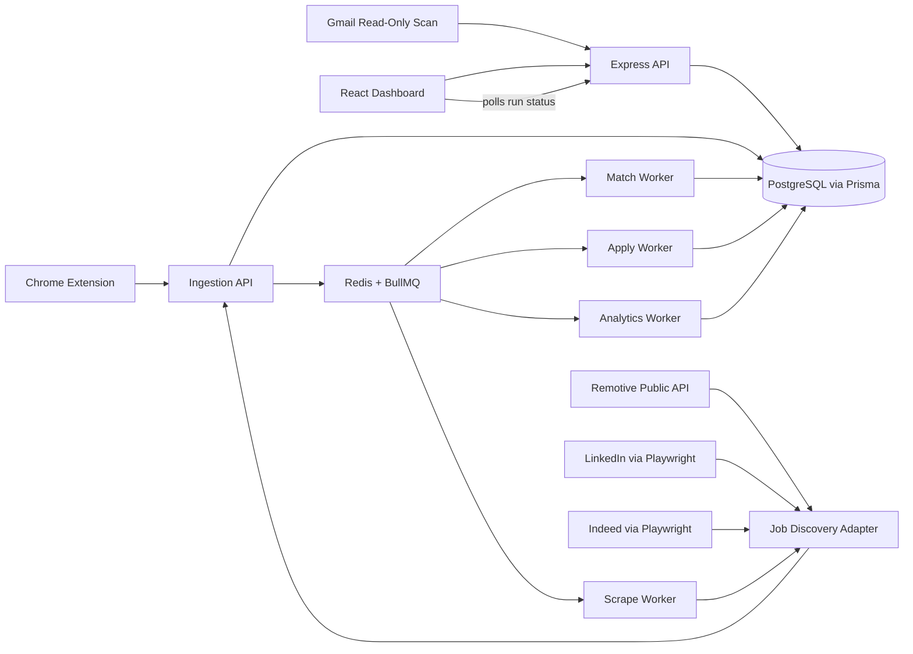

# TrackTrail — Automated Job Application Tracking System

TrackTrail is a **backend-heavy, multi-user job-application platform** that treats job search as a data pipeline rather than a CRUD tracker.

It combines job capture, multi-source discovery, de-duplication, explainable matching, application preparation, analytics, Gmail ingestion, evidence-constrained resume tailoring, account management, a web dashboard, a native mobile app, and a Chrome extension behind one REST API.

> **Recruiter / hiring manager:** Start with [`docs/00_Recruiter_Project_Summary.md`](docs/00_Recruiter_Project_Summary.md) for the engineering story, then [`docs/10_QA_Security_and_Verification_Report.md`](docs/10_QA_Security_and_Verification_Report.md) for verification evidence, security checks, and limitations.

---

## Recruiter TL;DR

| Area | Current implementation |
|---|---|
| Backend | Node.js 22, Express 5 REST API |
| Database | PostgreSQL + Prisma 5 |
| Async processing | Redis + BullMQ, separate worker process |
| Web | React 19 + Vite + Tailwind |
| Mobile | Expo 57 / React Native 0.86 / TypeScript |
| Browser extension | Chrome Manifest V3 |
| Browser automation | Playwright |
| Matching | TF-IDF + weighted skill overlap; deterministic and explainable |
| Resume tailoring | Evidence-constrained reordering/rewording; optional server-side LLM |
| Job discovery | Remotive public API + Playwright-based LinkedIn, Indeed, Naukri, Internshala, Wellfound and Unstop adapters |
| Authentication | bcrypt + short-lived access JWTs + rotating hashed refresh tokens |
| Authorization | User/admin RBAC with database-backed account-state checks |
| Database design | 22 Prisma models, 9 SQL migrations, triggers and partial unique indexes |
| Automated verification | **532 automated tests**: server 311, web 54, extension 92, mobile 75 |

### What this project demonstrates

- Backend/API design with thin request handlers and asynchronous workers.
- Relational data modelling with explicit global/private ownership rules.
- Authentication, authorization, session rotation, token revocation, and account lifecycle security.
- Multi-source ingestion with normalization, exact de-duplication, bounded fuzzy matching, and canonical job identity.
- Deterministic, explainable job ranking rather than an opaque trained model.
- Playwright-based browser automation with human review before final application submission.
- Gmail OAuth/read-only ingestion and evidence-constrained resume tailoring.
- A web application, mobile client, browser extension, and admin surface sharing one backend.
- Automated verification, migration testing, isolation testing, CI, queue retry behavior, and documented limitations.

This is intentionally **not presented as a production-scale or fully autonomous job-application system**. External job boards can change markup or block automated browsers, and the project documents those constraints rather than claiming to bypass them.

---

## Why this project is technically interesting

Most job trackers stop at storing applications. TrackTrail focuses on the harder engineering problems around the tracker:

- **Noisy external data:** the same job can appear across multiple sources with different URLs, formatting, or descriptions.
- **Identity resolution:** ingestion needs to determine whether an incoming posting is new or a duplicate of an existing canonical job.
- **Decision support:** jobs are ranked against a candidate profile using deterministic, explainable matching.
- **Asynchronous processing:** scraping, matching, analytics, ingestion, and browser automation run through Redis + BullMQ instead of blocking API requests.
- **Human-controlled automation:** the apply engine prepares supported forms but stops before final submission.
- **Multi-user isolation:** global catalog data and private user data have different ownership rules enforced in both application code and PostgreSQL.
- **Security-sensitive account lifecycle:** blocking, deletion, password reset, role management, and token revocation are backend concerns rather than UI-only features.
- **Truthful AI-assisted tailoring:** an optional LLM can help tailor a resume, but generated content is constrained and validated against existing resume evidence.

The frontend and browser extension are control surfaces. The core engineering value is the ingestion → decision → execution pipeline behind them.

---

## Problem Statement

Job searching produces a stream of noisy, duplicated, and scattered information. The same role can be cross-posted across LinkedIn, Indeed, Naukri, and other sources; application state can live across spreadsheets and email; and manually judging every job against a resume does not scale.

TrackTrail addresses three concrete problems:

1. **Duplicate listings:** the same role arriving from different sources should not become multiple independent jobs.
2. **Relevance triage:** listings should be ranked against a candidate profile before the user spends time applying.
3. **Outcome feedback:** recorded outcomes can influence future skill weighting instead of leaving the ranking system static.

The resulting flow is:

```text
Capture / Discover
       ↓
Normalize
       ↓
Exact + bounded fuzzy de-duplication
       ↓
Canonical job record
       ↓
Explainable matching
       ↓
Human-reviewed application preparation
       ↓
Tracked outcome
       ↓
Analytics / learning feedback
```

---

## Architecture

The API is intentionally a thin layer. It validates requests, performs minimal synchronous work such as authentication and de-duplication checks, and delegates expensive or failure-prone operations to background workers.


```mermaid
flowchart LR
  Extension[Chrome Extension] --> Ingest[Ingestion API]
  Remotive[Remotive Public API] --> Discovery[Job Discovery Adapter]
  LinkedIn[LinkedIn via Playwright] --> Discovery
  Indeed[Indeed via Playwright] --> Discovery
  Discovery --> Ingest
  Gmail[Gmail Read-Only Scan] --> API[Express API]
  API --> DB[(PostgreSQL via Prisma)]
  Ingest --> DB
  Ingest --> Queue[Redis + BullMQ]
  Queue --> Match[Match Worker]
  Queue --> Apply[Apply Worker]
  Queue --> Analytics[Analytics Worker]
  Queue --> Scrape[Scrape Worker]
  Match --> DB
  Apply --> DB
  Analytics --> DB
  Scrape --> Discovery
  Dashboard[React Dashboard] --> API
  Dashboard -- polls run status --> API
```

### Process responsibilities

**API process — `server/server.js`**

- Authentication and authorization.
- Request validation.
- Thin Prisma-backed reads/writes.
- De-duplication checks that must happen synchronously to close ingest race windows.
- Queue submission.
- Security middleware, rate limiting, and session behavior.

**Worker process — `server/worker.js`**

- Ingestion processing.
- Job matching.
- Job discovery/scraping.
- Playwright application preparation.
- Analytics and related background processing.

The API and worker are separate processes so slow browser work, scraper failures, retries, and provider-specific problems do not become request/response failures. BullMQ provides retry/backoff behavior and queue history provides an operational record of background work.

### Module responsibilities

| Module | Responsibility |
|---|---|
| API | Auth, validation, scoped reads/writes, queue enqueueing |
| Ingestion | Common normalization + de-duplication path for discovered, captured, Gmail, and manually tracked jobs |
| Job discovery | Admin-triggered asynchronous discovery across supported providers |
| De-duplication | Exact hash first, then bounded fuzzy comparison for the same company within a 14-day window |
| Matching | TF-IDF cosine similarity + curated/weighted skill overlap |
| Apply engine | Playwright automation with ATS field detection; stops before final submit |
| Learning loop | Uses recorded outcomes to adjust skill weights |
| Analytics | Computes user-scoped application metrics |
| Gmail | Read-oriented job-signal ingestion through OAuth |
| Resume tailoring | Evidence-constrained resume reordering/rewording with optional server-side LLM support |

---

## External Platform Constraints

External job platforms differ in availability, markup stability, authentication requirements, and anti-bot behavior.

- **Remotive** is accessed through its public API.
- **LinkedIn, Indeed, Naukri, Internshala, Wellfound, and Unstop** are accessed by the discovery worker through Playwright/browser automation.
- The Chrome extension supports job capture from the six browser-oriented platforms above.
- Provider failures are reported as explicit outcomes such as `error`, `blocked`, or `unavailable` rather than silently being treated as successful empty results.
- The implementation does **not** attempt to bypass CAPTCHAs, authentication walls, or other anti-bot controls.

A provider can therefore legitimately return an error or blocked result when its current platform behavior does not permit the automated browser flow. This is an explicit system limitation, not a hidden failure mode.

---

## Core Product Capabilities

### 1. Job Tracking

- Create and manage applications.
- Track status, interview dates, notes, and source.
- View matched jobs, companies, sources, and analytics.
- Maintain user-specific records without exposing another user's private data.

### 2. Job Capture

Jobs can enter through:

- Manual tracking.
- Chrome extension capture.
- Read-only Gmail scanning.
- Admin-operated discovery.

All paths converge on the same ingestion and de-duplication logic where applicable.

### 3. Job Discovery

Admin-operated discovery supports:

- Remotive
- LinkedIn
- Indeed
- Naukri
- Internshala
- Wellfound
- Unstop

Discovery runs asynchronously. A scrape run moves through states such as `queued → running → succeeded / failed / blocked`, with per-source results recorded.

### 4. Explainable Matching

The current score is deterministic:

```text
score =
  0.6 × TF-IDF cosine similarity
  + 0.4 × weighted skill overlap
```

Scores are clamped to 0–100 and stored with an explanation containing information such as matched skills, missing skills, and similarity information. A score of **70 or higher** marks a job as `matched`.

This is **not a trained ML model**. The deterministic design keeps ranking decisions explainable. The matching interface leaves a defined path for a future embedding-based scorer.

### 5. Human-in-the-Loop Application Engine

The apply worker uses Playwright to prepare supported application forms.

Current flow:

1. Open the posting/application flow.
2. Detect supported fields.
3. Fill fields the engine can identify.
4. Capture the result/state.
5. Stop at `pending_review`.
6. Require the user to perform final submission.

The system does **not** blindly submit applications.

### 6. Resume Tailoring

Resume tailoring can use an optional server-side LLM provider, but the core constraint is evidence preservation:

> The system may reorder or reword information already present in the resume; it must not invent skills, employers, numbers, or other unsupported claims.

Generated changes are validated against extracted resume evidence and require user approval.

### 7. Gmail Integration

The Gmail integration is read-oriented. OAuth is used to access relevant messages, and job-related signals are extracted without treating email parsing as authoritative application-state mutation.

### 8. Mobile Application

The native mobile client provides authentication, password reset, application tracking, job discovery/match scores, analytics, profile management, Gmail connection/scanning, company/source views, resume management/tailoring, push/in-app reminders, and account deletion.

### 9. Chrome Extension

The Manifest V3 extension supports job capture from LinkedIn, Indeed, Naukri, Internshala, Wellfound, and Unstop.

Extraction is layered:

1. Platform-specific selectors.
2. Schema.org `JobPosting` JSON-LD.
3. Page title/meta fallback.

Fields remain editable before saving, and missing fields are omitted rather than invented.

---

## Multi-User Data Isolation

TrackTrail separates **global catalog data** from **private user data**.

| | Global data | Private data |
|---|---|---|
| Jobs | `owner_user_id IS NULL` | `owner_user_id = user` |
| Origin | Admin discovery | Manual, Gmail, extension |
| Visibility | All users | Owner only |
| Enforcement | Visibility helper + PostgreSQL trigger + scoped indexes | Same controls + ownership checks |

Important invariants:

- The server decides whether a saved job is global or private; a client cannot create a global job merely by sending a different source value.
- Shared `jobs` queries use centralized visibility logic.
- PostgreSQL `enforce_job_scope` prevents invalid owner/scope combinations and owner changes.
- Partial unique indexes keep global and per-owner de-duplication keys separate.
- Foreign private IDs return `404`, avoiding disclosure of another user's resource existence.
- Sources, companies, notifications, tracked jobs, profiles, resumes, and sessions are scoped consistently.

This isolation is tested over HTTP with multiple users/admin scenarios and against real PostgreSQL migration/schema behavior.

---

## Authentication, Authorization & Account Security

### Authentication

- bcrypt password hashing.
- 15-minute access tokens.
- Opaque 256-bit refresh tokens stored only as SHA-256 hashes.
- Refresh-token rotation on every use.
- Reuse detection that can revoke the complete token family.
- Purpose-scoped password-reset and OAuth-state tokens that cannot be used as session tokens.

### Client session handling

- Web: refresh token in an HttpOnly cookie; access token kept in memory.
- Mobile: secure OS-backed storage such as Keychain/Keystore.
- Extension: dedicated client/session contract.

### Authorization and account state

Roles are `user` and `admin`. The server re-checks the account from the database on each authenticated request rather than trusting role/status information indefinitely from a JWT.

This allows blocking, deletion, role changes, and token-version changes to take effect promptly.

### Account lifecycle

Users can delete their own accounts with password confirmation. Admins can block, unblock, delete normal users, and change roles subject to safeguards.

Safeguards include:

- Admins cannot modify themselves through the admin user-management actions.
- An admin cannot delete/block another admin through the normal-user management path.
- The last active administrator cannot be deleted.
- Blocking increments the token version and revokes refresh sessions.
- Account deletion removes private account data in a transaction while preserving shared catalog data.
- Self-deletion is rate-limited.

The latest hardening pass also addressed bootstrap-role case handling, password-reset token invalidation, auth error leakage, and the baseline migration required to build the schema correctly from an empty database.

---

## Database Design

The repository contains **22 Prisma models and 9 SQL migrations**.

The schema uses:

- Explicit global/private ownership boundaries.
- Foreign keys and cascade rules for user-owned data.
- `NO ACTION` behavior where shared catalog data must survive user deletion.
- Partial unique indexes for scoped job identity/de-duplication.
- PostgreSQL triggers for ownership/scope invariants.
- Account status constraints.
- Migration tests that verify an empty database can be built into the expected schema.

The migration chain is intended to be deployable with:

```bash
npx prisma migrate deploy
npx prisma generate
```

Production deployment should not use `prisma migrate dev`.

---

## Engineering Decisions

| Decision | Reason |
|---|---|
| Synchronous de-duplication during ingest | The candidate set is bounded; doing the check inline closes a race where concurrent ingests could both pass an asynchronous duplicate check. |
| TF-IDF + weighted skills | Deterministic and explainable ranking without claiming a trained ML model. |
| Gmail as a signal, not write authority | Email heuristics are noisy; blindly changing application outcomes would corrupt analytics and the learning loop. |
| Apply engine stops before submit | Automation prepares the application while the user retains final control. |
| Resume tailoring has no unrestricted “add” operation | The no-fabrication constraint is enforced by the data flow instead of trusting an LLM. |
| Database-backed token version | Stateless JWTs alone cannot provide immediate revocation after account changes. |
| Shared ingestion path | Discovery, extension capture, Gmail signals, and manual ingestion benefit from one normalization/de-duplication contract. |

---

## Reliability & Operational Characteristics

- BullMQ retry/backoff for background jobs.
- Separate API and worker processes.
- Queue job history provides an operational record for background work.
- Discovery runs have explicit lifecycle states and per-source results.
- Dynamic discovery-status polling is deliberately non-cacheable so browser `304` behavior cannot freeze the UI on stale run status.
- Discovery polling stops after 45 seconds if a run remains queued, with an explicit worker/Redis requirement shown to the user.
- Reminder processing uses unique deduplication keys to avoid repeated sends.
- Browser failures are isolated from the API process.

---

## Testing & Verification

The documented verification run contains **532 automated tests**:

| Component | Tests |
|---|---:|
| Server | 311 |
| Web client | 54 |
| Browser extension | 92 |
| Mobile | 75 |
| **Total** | **532** |

Verification covers more than unit-level logic. It includes:

- Authentication and authorization flows.
- Multi-user data isolation.
- Account block/unblock/delete behavior.
- PostgreSQL migration/schema verification.
- Database constraints and cascade behavior.
- Browser extension extraction and platform behavior.
- Resume tailoring constraints.
- Gmail integration behavior.
- Client builds, lint/type checks, and tests.
- Queue/reliability behavior.

CI runs lint, typecheck, builds, and the test suites on every change, with PostgreSQL available for database verification.

> Test counts are repository evidence, not a claim that every possible production scenario is covered.

---

## Scalability: What Is True Today

### Designed for

- Stateless API instances.
- Independent worker processes that can be scaled per queue.
- Database indexes around ownership and ordering paths.
- Bounded fuzzy matching rather than an unbounded comparison across the full job corpus.
- Queue-based isolation of slow/failure-prone work.

### Not yet demonstrated

- No load/performance test has been performed, so no throughput or latency-at-scale numbers are claimed.
- Rate limiting is currently in-process; horizontally scaled API instances would need a shared rate-limit store such as Redis.
- Analytics are computed live per user; larger scale would justify caching or rollups.
- Job-board discovery remains dependent on Playwright, browser binaries, selectors, and provider behavior.

---

## Honest Limitations

This section is intentionally explicit because these are important when evaluating the project technically.

- **External job-board reliability:** selectors and markup can change, and providers can block automated browsers. The system reports blocked/error states and does not attempt to bypass anti-bot controls.
- **Discovery dependencies:** the worker process, Redis, and Playwright Chromium are required for asynchronous discovery/automation.
- **Analytics:** current conversion metrics are based on each application's current status, not a historical stage timeline. Average response time is intentionally unavailable because there is no reliable outcome-transition timestamp.
- **Deduplication threshold:** the fuzzy threshold is hand-tuned rather than learned from a labeled dataset with measured precision/recall.
- **No load testing:** no throughput claims are made.
- **Email verification:** sign-up does not currently verify email ownership.
- **Gmail production setup:** Gmail scanning requires the application's own Google OAuth credentials and appropriate consent configuration.
- **Live scraper verification:** some public-markup-based providers are covered by fixtures/extractors but are inherently subject to live-site changes.

---

## Future Engineering Improvements

The existing design leaves clear upgrade paths rather than requiring a rewrite:

1. Add application stage-history storage so analytics can measure “ever reached Interview/Offer” rather than only current status.
2. Add a reliable outcome timestamp so average response time can be calculated honestly.
3. Evaluate embedding-based matching with `pgvector` when corpus size justifies it; the scoring interface already provides an upgrade path.
4. Strengthen live scraper regression coverage and observability as providers change markup.
5. Add ATS adapters such as Lever, Workday, or additional application flows behind the existing adapter interface.
6. Replace the hand-tuned fuzzy threshold with a labeled dataset and measured precision/recall.
7. Scale workers horizontally by queue as workload grows.

These are extensions of the existing architecture, not claims about functionality that is already implemented.

---

## Repository Structure

| Path | Purpose |
|---|---|
| `server/` | Express API, workers, Prisma schema/migrations, backend tests — see [`server/README.md`](server/README.md) |
| `client/` | React web application and admin console — see [`client/README.md`](client/README.md) |
| `mobile/` | Expo / React Native application — see [`mobile/README.md`](mobile/README.md) |
| `browser-extension/` | Chrome Manifest V3 extension — see [`browser-extension/README.md`](browser-extension/README.md) |
| `docs/` | Architecture, engine design, setup, API, deployment, client implementation, Gmail/resume, QA/security, and release documentation |
| `.github/workflows/` | CI, release, and scheduled workflow definitions |

---

## Quick Start

### Prerequisites

- Node.js 22+
- PostgreSQL (verified with PostgreSQL 16)
- Redis for the worker process
- Playwright Chromium for browser-based discovery/automation

The full setup guide is [`docs/03_Setup_Installation_and_Contributing.md`](docs/03_Setup_Installation_and_Contributing.md).

### API

```bash
cd server
npm ci
cp .env.example .env
# Configure DATABASE_URL, JWT_SECRET, CLIENT_URL and other required settings.
npx prisma generate
npx prisma migrate deploy
npm start
```

### Worker

Run separately from the API:

```bash
cd server
npm run worker
```

The worker handles discovery, matching, application preparation, analytics, and other queued operations.

### Web client

```bash
cd client
npm ci
npm run dev
```

### Mobile and extension

See [`mobile/README.md`](mobile/README.md) and [`browser-extension/README.md`](browser-extension/README.md) for platform-specific setup and release instructions.

---

## Running the Tests

```bash
cd server
npm test

cd ../client
npm test
npm run lint
npm run build

cd ../mobile
npm run typecheck
npm run lint
npm test

cd ../browser-extension
npm test
```

For server database verification against real PostgreSQL, configure `TEST_DATABASE_URL` as described in [`docs/03_Setup_Installation_and_Contributing.md`](docs/03_Setup_Installation_and_Contributing.md).

---

## Documentation Index

| Document | Purpose |
|---|---|
| [`00_Recruiter_Project_Summary.md`](docs/00_Recruiter_Project_Summary.md) | Recruiter-facing engineering summary and 5-minute code-review path |
| [`01_Project_Structure_and_Architecture.md`](docs/01_Project_Structure_and_Architecture.md) | System architecture, repository structure, data model, authentication, authorization, and security design |
| [`02_Job_Application_Engine_Design.md`](docs/02_Job_Application_Engine_Design.md) | Ingestion, discovery, matching, apply engine, analytics, reminders |
| [`03_Setup_Installation_and_Contributing.md`](docs/03_Setup_Installation_and_Contributing.md) | Local setup, environment, tests, verification, contribution workflow |
| [`04_API_Reference.md`](docs/04_API_Reference.md) | REST API reference and route conventions |
| [`05_Deployment_and_Operations.md`](docs/05_Deployment_and_Operations.md) | Deployment topology, release checklist, operations, CI/CD, scaling notes |
| [`06_Web_Client_Production_and_Responsiveness.md`](docs/06_Web_Client_Production_and_Responsiveness.md) | React web client and admin console |
| [`07_Mobile_App_Implementation_and_Release.md`](docs/07_Mobile_App_Implementation_and_Release.md) | Expo/React Native architecture, security, push, deep links, release |
| [`08_Browser_Extension_Status_and_Hardening.md`](docs/08_Browser_Extension_Status_and_Hardening.md) | Manifest V3 extension, extraction, security, installation, limits |
| [`09_Gmail_Integration_and_Resume_Tailoring.md`](docs/09_Gmail_Integration_and_Resume_Tailoring.md) | Gmail OAuth/read-only ingestion and evidence-constrained resume tailoring |
| [`10_QA_Security_and_Verification_Report.md`](docs/10_QA_Security_and_Verification_Report.md) | Test/build results, database verification, security review, reliability checks, limitations |
| [`11_Roles_Permissions_Platforms_and_Release_Notes.md`](docs/11_Roles_Permissions_Platforms_and_Release_Notes.md) | Roles, permissions, isolation, account management, platform support, migrations, release notes |

### Recommended 5-minute review path

1. Read this README for the system-level picture.
2. Open [`docs/00_Recruiter_Project_Summary.md`](docs/00_Recruiter_Project_Summary.md) for the concise engineering story.
3. Open [`docs/01_Project_Structure_and_Architecture.md`](docs/01_Project_Structure_and_Architecture.md) for architecture/data/security depth.
4. Open [`docs/02_Job_Application_Engine_Design.md`](docs/02_Job_Application_Engine_Design.md) for ingestion, matching, discovery, and automation.
5. Open [`docs/10_QA_Security_and_Verification_Report.md`](docs/10_QA_Security_and_Verification_Report.md) to verify the claims and review known limitations.

---

## Project Scope

TrackTrail is an individual full-stack engineering project covering backend APIs, PostgreSQL data management, web and mobile clients, browser-extension integration, testing, and technical documentation. The repository documents the implemented architecture, verification steps, and known limitations.
